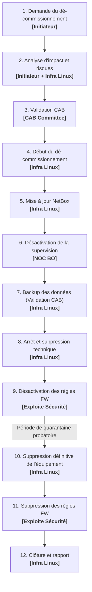

# Procédure — Décommissionnement de serveurs et équipements d'infrastructure

| VERSION | AUTEUR | REVISION | PARTAGER |
|---------|--------|----------|----------|
| 1.0 | Amit SAMY | Équipe Infra Linux / Exploite Sécurité / NOC BO | Infra Linux, Exploite Sécurité, NOC BO, CAB Committee |

---

### Fiche Métadonnées

* **Statut** : Validé / Officiel
* **Date d'effet** : 24 septembre 2026
* **Classification** : Document Interne Outremer Telecom
* **Périmètre d'application** : Machines virtuelles (VMware vSphere), serveurs physiques bare-metal, appliances matérielles et services applicatifs hébergés sur l'ensemble des environnements (PROD, PREPROD, DEV, LAB) et datacenters (TH2, Martinique, Guadeloupe, Guyane, Réunion, Mayotte).
* **Lien Wiki** : [wiki.corp.intranet.local — Procédure de Décommissionnement](https://wiki.corp.intranet.local/doc/procedure-decommissionnement-de-serveurs-et-equipements-dinfrastructure-k6YXn9BANa)

---

## 1. Contexte & Objectifs

La mise hors service d'un équipement ou d'un serveur d'infrastructure est une opération sensible qui ne se limite pas à l'extinction d'une machine. Un décommissionnement non maîtrisé peut entraîner des pannes de services par effet de bord (flux réseau résiduels, dépendances applicatives cachées), des failles de sécurité, l'accumulation de règles de pare-feu orphelines, des alertes de supervision intempestives et un gaspillage de ressources informatiques (adresses IP, datastores VMFS/SAN, licences).

Cette procédure standardisée a pour objectifs :
1. **Sécuriser la fin de vie des systèmes** en garantissant l'absence d'impact non anticipé sur la production et les utilisateurs.
2. **Garantir l'intégrité et la traçabilité des données** via une sauvegarde de référence validée avant toute action irréversible.
3. **Purger méthodiquement l'écosystème** : supervision (NOC), filtrage réseau (Firewall), annuaires DNS, inventaires d'automatisation (Ansible, Semaphore) et référentiel IPAM/DCIM (NetBox).
4. **Récupérer et réallouer les ressources d'infrastructure** (vCPU, mémoire vive, stockage SAN/datastore, blocs d'adresses IPv4/IPv6).

---

## 2. Matrice des Rôles & Responsabilités (RACI)

| Rôle / Équipe | Responsabilité principale | Implication dans le workflow |
|---|---|---|
| **Initiateur / Demandeur** | Responsable applicatif, chef de projet ou métier formulant le besoin de mise hors service. | Expression de besoin, analyse d'impact applicatif, validation fonctionnelle. |
| **Infra Linux** | Équipe d'ingénierie et d'exploitation des systèmes Linux/Unix et virtualisation. | Analyse d'impact technique, coordination, sauvegardes finales, extinction, quarantaine, suppression VMware/physique, nettoyage DNS/NetBox/Ansible, clôture. |
| **CAB Committee** | Comité de validation des changements (Change Advisory Board). | Évaluation des risques globaux, approbation formelle du changement et validation de la politique de rétention des sauvegardes. |
| **NOC BO** | Centre de supervision et d'exploitation opérationnelle (Supervision Back-Office). | Mise en maintenance (downtime) et désactivation définitive des sondes de monitoring (Zabbix, Prometheus, Centreon). |
| **Exploite Sécurité** | Équipe réseau et sécurité périmétrique / firewalling. | Désactivation temporaire des règles de flux pare-feu pendant la quarantaine, puis suppression définitive des règles et objets adresses. |

---

## 3. Diagramme de Flux du Processus (Workflow Visuel)

Le processus suit un cycle de vie rigoureux et séquentiel composé de **12 étapes ordonnées**, réparties entre les différents acteurs :


### Synthèse séquentielle du parcours



---

## 4. Déroulement Détaillé des 12 Étapes

### Étape 1 : Demande du dé-commissionnement
* **Acteur responsable** : `[Initiateur]` (Demandeur, Chef de projet, Responsable d'application)
* **Déclencheur** : Fin de vie contractuelle, migration d'application vers une nouvelle infrastructure, obsolescence matérielle ou logicielle, rationalisation de coûts.
* **Actions requises** :
  1. Formalisation d'une demande officielle via l'outil de gestion des tickets (ITSM / Jira / EasyVista).
  2. Fourniture des éléments d'identification obligatoires :
     * Nom d'hôte complet (FQDN) et adresse(s) IP.
     * Environnement : Production (`PROD`), Pré-production (`PREPROD`), Recette/Validation (`VAL`), Développement (`DEV`), ou Lab.
     * Type de matériel : Machine virtuelle (vSphere/KVM) ou Serveur physique (Bare-metal).
     * Applications hébergées et dépendances connues.
     * Justification détaillée du décommissionnement.
     * Confirmation écrite du propriétaire de la donnée attestant que les services ont été transférés ou peuvent être arrêtés.
     * Date de coupure souhaitée.
* **Critère de sortie** : Demande d'intervention validée et affectée à l'équipe Infra Linux.

---

### Étape 2 : Analyse d'impact et risques
* **Acteurs responsables** : `[Initiateur]` conjointement avec `[Infra Linux]`
* **Objectif** : Identifier l'ensemble des adhérences techniques et évaluer la criticité pour prévenir tout impact collatéral.
* **Audit technique approfondi par l'Infra Linux** :
  * **Réseau & Exposition Web** :
    * Analyse des flux et ports en écoute : `ss -tulpn` ou `netstat -plntu`.
    * Analyse des sessions réseau actives : `ss -ta`.
    * Vérification des Reverse Proxies (Nginx, HAProxy, F5) : identifier si des upstreams ou des vhosts renvoient vers la machine cible.
    * Certificats TLS/SSL : vérifier si des certificats d'entreprise ou Let's Encrypt sont hébergés et s'ils doivent être révoqués ou migrés.
  * **Stockage & Données** :
    * Vérification des montages distants : `findmnt` ou `cat /etc/fstab` (montages NFS, CIFS, LUNs SAN via multipath).
    * Présence de bases de données locales ou partagées (MySQL/MariaDB Galera, PostgreSQL, Informix, Oracle).
  * **Automatisation & Tâches planifiées** :
    * Inventaire des crontabs : `/etc/crontab`, `/etc/cron.*`, `/var/spool/cron/crontabs/*`.
    * Tâches d'ordonnancement d'entreprise (Dollar Universe `$U`, Jenkins, Airflow, batchs de nuit).
    * Clés SSH et comptes d'administration (`spui-runner`, `authorized_keys`).
  * **Inventaires d'infrastructure (IaC)** :
    * Présence dans les inventaires Ansible (`hosts.yml` dans `infra-management-system` et `LINUX/inventory`).
    * Présence dans les templates et projets Semaphore CI/CD.
* **Planification du changement** :
  * Définition de la période probatoire de quarantaine (extinction à froid conservatoire, fixée par défaut à **15 à 30 jours calendaires** selon la criticité).
  * Rédaction du plan de repli (Rollback Plan).
  * Rédaction du dossier de changement pour le CAB (Change Request - RFC).
* **Critère de sortie** : Dossier de changement complet déposé à l'ordre du jour du comité CAB.

---

### Étape 3 : Validation CAB
* **Acteur responsable** : `[CAB Committee]` (Change Advisory Board)
* **Actions requises** :
  1. Présentation de la demande de décommissionnement lors de la séance du CAB.
  2. Évaluation de la conformité :
     * Les analyses d'impacts sont-elles exhaustives ?
     * Le plan de rollback est-il viable ?
     * La politique de rétention de sauvegarde est-elle validée ?
     * La fenêtre temporelle d'intervention est-elle compatible avec les périodes de gel de production (ex: clôtures de facturation, fin de mois) ?
  3. Décision formelle du CAB :
     * **GO (Approuvé)** : Attribution d'un numéro d'approbation officiel (ex: `CAB-2026-XXXX`).
     * **Demande de révision** : Compléments d'analyse requis.
* **Critère de sortie** : Accord formel du CAB et statut du ticket RFC basculé à `Approved`.

---

### Étape 4 : Début du dé-commissionnement
* **Acteur responsable** : `[Infra Linux]`
* **Objectif** : Lancement formel de la phase opérationnelle suite au feu vert du CAB.
* **Actions requises** :
  1. Notification officielle envoyée aux parties prenantes (Métier, Support, NOC, Sécurité) informant du démarrage de l'opération technique.
  2. Verrouillage préventif des accès applicatifs afin d'empêcher toute injection de nouvelles données avant la sauvegarde finale.
* **Critère de sortie** : Phase opérationnelle ouverte et tracée dans le ticket de changement.

---

### Étape 5 : Mise à jour NetBox
* **Acteur responsable** : `[Infra Linux]`
* **Objectif** : Assurer la cohérence temps réel du référentiel IPAM/DCIM d'entreprise.
* **Actions requises** :
  1. Connexion au portail NetBox d'entreprise (`https://netbox.corp.intranet.local`).
  2. Localisation de la fiche du Device ou de la Virtual Machine.
  3. Modification du statut principal :
     * Passer de `Active` à `Decommissioning` (ou `Offline` selon le cycle interne).
  4. Mise à jour des annotations :
     * Renseigner dans le champ commentaire : `Décommissionnement en cours - RFC: CAB-2026-XXXX - Initiateur: [Nom] - Extinction le: [Date]`.
     * Tagger la date programmée pour la suppression physique/définitive.
* **Critère de sortie** : Fiche NetBox mise à jour reflétant l'état de pré-retrait.

---

### Étape 6 : Désactivation de la supervision
* **Acteur responsable** : `[NOC BO]` (Supervision & Exploitation Back-Office)
* **Objectif** : Éviter l'émission de fausses alertes, la pollution des dashboards de supervision et les déclenchements d'escalades d'astreinte lors de l'arrêt des services et du serveur.
* **Actions requises** :
  1. Accès aux consoles de supervision de l'entreprise (Zabbix, Prometheus / Alertmanager, Centreon).
  2. Programmation d'une mise en maintenance prolongée (Scheduled Downtime) ou désactivation des sondes de l'hôte :
     * Sondes ICMP (ping).
     * Agents système (Zabbix agent, Node Exporter, SNMP).
     * Sondes applicatives et de processus (Blackbox exporter, checks HTTP/TCP, services).
  3. Validation avec l'équipe Infra Linux que l'hôte n'apparaît plus en alerte active.
* **Critère de sortie** : Hôte acquitté et désactivé dans tous les outils de monitoring.

---

### Étape 7 : Backup des données (Validation CAB)
* **Acteur responsable** : `[Infra Linux]`
* **Objectif** : Créer l'archive définitive de référence avant toute coupure irréversible, conformément aux exigences validées en CAB.
* **Actions requises** :
  1. **Sauvegarde applicative & données** :
     * Dump cohérent des bases de données locales (`mysqldump`, `pg_dump`, `dbexport` Informix, exports RMAN Oracle).
     * Archive des arborescences de configuration et de données locales :
       ```bash
       tar -czvf /backup/decom_<hostname>_$(date +%Y%m%d).tar.gz /etc /var/log /var/www /opt /home
       ```
  2. **Sauvegarde de la machine complète** :
     * Pour une VM VMware : Déclenchement d'un snapshot à froid ou déclenchement d'une sauvegarde image complète sur NetBackup / Veeam.
  3. **Archivage et intégrité** :
     * Dépôt de l'archive sur le stockage de sauvegarde sécurisé et centralisé (ex: `/backup` sur `trp-bcki-sys1` ou appliance de sauvegarde dédiée).
     * Calcul et enregistrement de l'empreinte cryptographique de contrôle :
       ```bash
       sha256sum /backup/decom_<hostname>_$(date +%Y%m%d).tar.gz > /backup/decom_<hostname>_$(date +%Y%m%d).sha256
       ```
  4. **Application de la rétention CAB** :
     * Marquage de la durée de rétention obligatoire convenue (par défaut 90 jours à froid, jusqu'à 1 à 5 ans pour les données comptables ou réglementaires).
* **Critère de sortie** : Sauvegarde terminée, vérifiée intègre et consignée dans le dossier de décommissionnement.

---

### Étape 8 : Arrêt et suppression technique
* **Acteur responsable** : `[Infra Linux]`
* **Objectif** : Procéder à l'extinction contrôlée de la machine et au retrait des inventaires opérationnels, tout en conservant la machine intègre durant la quarantaine.
* **Actions requises** :
  1. **Arrêt ordonné des services** :
     ```bash
     systemctl stop <service_applicatif>
     ```
  2. **Synchronisation des disques et extinction propre** :
     ```bash
     sync
     shutdown -h now
     ```
  3. **Retrait des inventaires d'automatisation** :
     * Retrait de la machine ou mise en commentaire dans l'inventaire Ansible (`hosts.yml` dans `infra-management-system`).
     * Révocation des accès de déploiement automatisé (`spui-runner`, clés SSH).
     * Validation locale de la syntaxe de l'inventaire :
       ```bash
       ansible-inventory -i inventories/<env>/hosts.yml --graph
       ```
  4. **Engagement de la période de quarantaine probatoire** :
     * La VM ou le serveur physique reste **hors tension (powered off)** mais **strictement préservé sur le stockage** pendant la durée convenue (15 à 30 jours).
     * Aucun fichier disque (`.vmdk`), partition ou câblage physique n'est détruit durant cette phase.
* **Critère de sortie** : Machine éteinte, inventaires mis à jour, phase de quarantaine activée.

---

### Étape 9 : Désactivation des règles FW
* **Acteur responsable** : `[Exploite Sécurité]`
* **Objectif** : Couper l'ensemble des flux réseau entrants et sortants liés à l'équipement, tout en conservant la possibilité d'une réactivation instantanée en cas de besoin.
* **Actions requises** :
  1. Identification dans les gestionnaires de pare-feu (Fortinet FortiManager / Palo Alto Panorama / iptables) de toutes les politiques associées à l'IP ou au sous-réseau de la machine.
  2. **Désactivation (Disable)** des règles de filtrage (ne pas supprimer à ce stade).
  3. Ajout d'une annotation traçable sur chaque règle désactivée :
     * `DESACTIVE - Decom <hostname> - RFC: CAB-2026-XXXX - Date: YYYY-MM-DD`.
  4. Maintien en état désactivé pendant toute la durée de la quarantaine probatoire.
* **Critère de sortie** : Règles de pare-feu désactivées et tracées.

---

### Étape 10 : Suppression définitive de l'équipement
* **Acteur responsable** : `[Infra Linux]`
* **Condition préalable** : Terme échu de la période de quarantaine probatoire (15 à 30 jours) sans aucune alerte ni demande de réactivation formulée.
* **Actions requises** :
  1. **Cas d'une Machine Virtuelle (vSphere Client)** :
     * Connexion au vCenter concerné.
     * Clic droit sur la VM éteinte -> **Delete from Disk** (Supprimer du disque).
     * Vérification de la libération effective de l'espace sur le Datastore VMFS / vSAN.
  2. **Cas d'un Serveur Physique (Bare-metal)** :
     * Déconnexion électrique et réseau en salle informatique / datacenter.
     * Démontage physique des rails du rack.
     * **Effacement sécurisé des disques durs** : Formatage bas niveau / wipe cryptographique certifié (NIST SP 800-88 / DoD 5220.22-M) ou destruction physique par broyeur en cas de données confidentielles / cartes PCI HSM.
     * Prise en charge par la filière d'évacuation D3E (Déchets d'équipements électriques et électroniques).
  3. **Nettoyage du stockage SAN / NAS** :
     * Détachement des LUNs SAN auprès de l'équipe Stockage et suppression du zoning Fibre Channel / initiateurs iSCSI.
     * Suppression des répertoires exportés en NFS sur les baies de stockage.
  4. **Nettoyage Réseau & DNS** :
     * Suppression des enregistrements directs (A) et inverses (PTR) sur les serveurs DNS d'entreprise (`th2-dnsintra-01` / `th2-dnsc-res1`).
     * Libération des réservations statiques DHCP.
  5. **Mise à jour finale NetBox** :
     * Bascule du statut de l'équipement à `Decommissioned` ou suppression de l'objet VM/Device.
     * Libération de l'adresse IP dans les pools IPAM.
* **Critère de sortie** : Ressources informatiques, stockage, DNS et matériel totalement libérés et tracés.

---

### Étape 11 : Suppression des règles FW
* **Acteur responsable** : `[Exploite Sécurité]`
* **Objectif** : Assainir durablement la matrice de sécurité et éliminer toute règle ou objet orphelin sur les firewalls.
* **Actions requises** :
  1. Reprise des règles précédemment désactivées lors de l'Étape 9.
  2. Suppression définitive (Delete) des règles de filtrage.
  3. Suppression des objets adresses IP (`Address Objects`), groupes d'adresses (`Address Groups`), pools NAT et VIPs (Virtual IPs) devenus orphelins.
  4. Application et commit de la configuration sur les clusters pare-feux.
* **Critère de sortie** : Politique de sécurité pare-feu assainie et exempte de tout résidu lié à l'équipement décommissionné.

---

### Étape 12 : Clôture et rapport
* **Acteur responsable** : `[Infra Linux]`
* **Objectif** : Formaliser la fin des opérations, archiver la documentation technique et notifier les parties prenantes.
* **Actions requises** :
  1. Rédaction du Compte-Rendu (CR) de décommissionnement récapitulant :
     * Date de début, date d'extinction, date de suppression définitive.
     * Références de la sauvegarde d'archive (serveur, chemin, checksum SHA256, date d'expiration de la rétention).
     * Bilan des ressources restituées au pool d'infrastructure (nombre de vCPUs, Go de RAM, Go/To de stockage, adresses IP).
  2. Clôture formelle du ticket de changement CAB (statut basculé à `Closed - Successful`).
  3. Clôture du ticket de demande initial émis par l'initiateur.
  4. Diffusion de l'email de clôture à l'initiateur, au NOC BO et à l'Exploite Sécurité.
* **Critère de sortie** : Tickets clôturés, CR déposé sur le wiki et fin officielle du cycle de vie de l'équipement.

---

## 5. Procédure de Repli d'Urgence (Rollback Plan)

En cas de détection d'une dépendance non identifiée ou d'une anomalie critique de production **durant la période de quarantaine probatoire** (Étapes 8 et 9), le plan de repli suivant est appliqué immédiatement :

```text
[Alerte / Incident] 
        │
        ▼
1. Notification d'urgence au NOC BO et à l'Infra Linux (Astreinte si HNO)
        │
        ▼
2. Réactivation immédiate des règles de pare-feu par l'Exploite Sécurité (Réarmement des règles désactivées)
        │
        ▼
3. Démarrage de la machine par l'Infra Linux (vCenter : Power On / IPMI iLO/iDRAC)
        │
        ▼
4. Vérification du démarrage des services système et applicatifs
        │
        ▼
5. Réactivation de la supervision par le NOC BO
        │
        ▼
6. Constat de rétablissement du service avec le demandeur
        │
        ▼
7. Post-mortem : Identification de la dépendance manquée et report du décommissionnement
```

> **Délai prévisionnel de rétablissement (RTO)** : Moins de 15 minutes en période probatoire (machine conservée sur disque, règles FW conservées en état désactivé).

---

## 6. Checklist Opérationnelle Récapitulative

Cette grille de contrôle doit être dupliquée et jointe au ticket de suivi pour chaque décommissionnement :

| N° | Étape | Acteur | Statut | Date de réalisation | Opérateur |
|:---|:---|:---|:---:|:---:|:---|
| 01 | Demande formulée avec fiche descriptive complète | Initiateur | [ ] | | |
| 02 | Analyse d'impact technique & matrice de flux validée | Initiateur / Infra Linux | [ ] | | |
| 03 | Approbation formelle du comité CAB (N° RFC obtenu) | CAB Committee | [ ] | | |
| 04 | Début d'intervention & avis d'intervention envoyé | Infra Linux | [ ] | | |
| 05 | Statut NetBox basculé à `Decommissioning` | Infra Linux | [ ] | | |
| 06 | Supervision désactivée / Downtime posé (Zabbix/Prometheus) | NOC BO | [ ] | | |
| 07 | Sauvegarde intégrale réalisée & SHA256 validé | Infra Linux | [ ] | | |
| 08 | Arrêt propre OS & début de quarantaine (15-30j) | Infra Linux | [ ] | | |
| 09 | Règles FW désactivées avec tag de traçabilité | Exploite Sécurité | [ ] | | |
| -- | *Fin de la période probatoire sans incident* | -- | [ ] | | |
| 10 | Suppression définitive VM/disques/DNS/NetBox | Infra Linux | [ ] | | |
| 11 | Suppression définitive des règles FW et objets IP | Exploite Sécurité | [ ] | | |
| 12 | CR rédigé, ticket CAB et demande initiale clôturés | Infra Linux | [ ] | | |

---

## 7. Modèle de Compte-Rendu (CR) de Décommissionnement

```markdown
# Compte-Rendu de Décommissionnement Technique

* **Date d'exécution** : AAAA-MM-JJ
* **Équipement cible** : <hostname> (<IP>)
* **Environnement** : PROD / PREPROD / DEV
* **N° de Changement CAB** : CAB-2026-XXXX
* **Opérateur principal** : <Prénom Nom> (Infra Linux)

## 1. Calendrier d'exécution
* Date d'extinction initiale (Étape 8) : AAAA-MM-JJ
* Période de quarantaine : Du AAAA-MM-JJ au AAAA-MM-JJ (30 jours)
* Date de suppression définitive (Étape 10) : AAAA-MM-JJ

## 2. Sauvegarde & Archivage
* Emplacement de la sauvegarde : trp-bcki-sys1:/backup/decom_<hostname>_<date>.tar.gz
* Empreinte SHA256 : <hash_sha256>
* Durée de rétention validée : 90 jours (Échéance : AAAA-MM-JJ)

## 3. Ressources récupérées
* vCPU restitués : X
* Mémoire RAM libérée : XX Go
* Espace disque Datastore VMFS récupéré : XXX Go
* Adresses IP recyclées dans NetBox : <IP>

## 4. Validations des équipes partenaires
* [X] Supervision NOC purgée
* [X] Règles FW purgées (Exploite Sécurité)
* [X] Enregistrements DNS supprimés
* [X] NetBox clôturé à "Decommissioned"
* [X] Inventaire Ansible / IaC nettoyé
```
